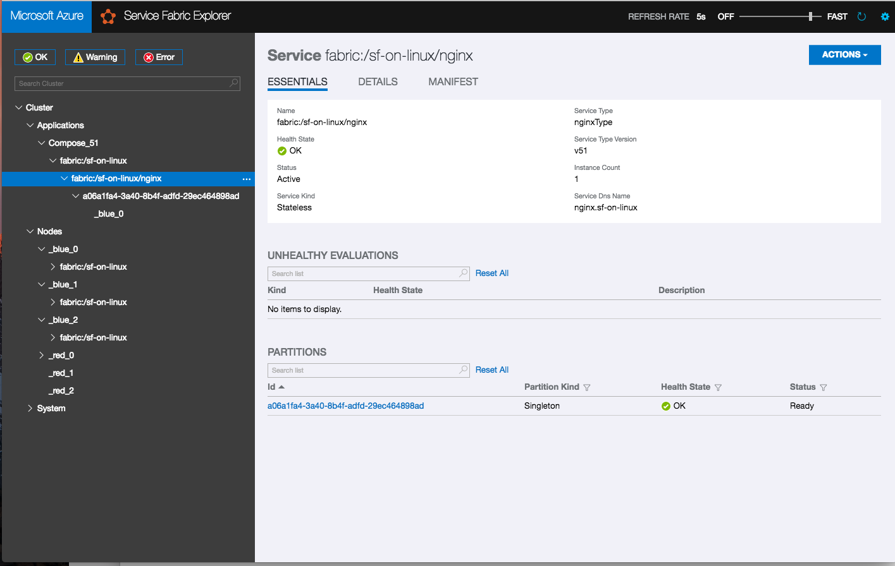

# Deploying NGINX to a Service Fabric on Linux with Docker-Compose

This tutorial walks you through and end-to-end deployment of NGINX to a Service Fabric Linux cluster running on Azure.

## Target Audience

The target audience for this tutorial is someone that is looking for hands-on experience for deploying a NGINX into a Service Fabric cluster with Docker-Compose. We will also be looking at how to create a Docker image with NGINX and also how to publish it to a private registry on the [Azure Container Registry](/azure/container-registry/).

## Solution Details

1. Provision Service Fabric Linux on Azure.
1. Provision Azure Container Registry (ACR).
1. Push the image into the registry.
1. Build  & Deploy the NGINX image to Service Fabric.

## Prerequisites

This tutorial assumes you have access to a Service Fabric Cluster on Linux. The examples here will use [Microsoft Azure](https://azure.microsoft.com/en-us/). If you currently do not have one, you can use the `deploy-sf-cluster.sh` under the `scripts` directory to create one.

These examples were tested on a MacOS (High Sierra) and on Linux (Ubuntu 16.04).

* A development computer running:
  * [Service Fabric SDK and tools](service-fabric-get-started-linux.md).
  * [Docker CE](https://docs.docker.com/engine/installation/#prior-releases).
  * [Service Fabric CLI](service-fabric-cli.md).

* Infrastructure components:
    * A registry in Azure Container Registry. See how to [create a container registry](../container-registry/container-registry-get-started-portal.md) in your Azure subscription.
    * A copy of the certificate and key for NGINX Plus.

## Setup Azure Container Registry

## Procedure

1. Create an ACR instance

    ```bash
    az acr create \
        --resource-group $resourcegroupname \
        --name $acrname \
        --sku Basic
    ```
    OUTPUT:
    ```bash
    {
        "adminUserEnabled": false,
        "creationDate": "2018-02-02T17:23:16.264759+00:00",
        "id": "/subscriptions/00000-000-0000-0000-0/resourceGroups/nginx-demo-rg/providers/Microsoft.ContainerRegistry/registries/casatix",
        "location": "eastus",
        "loginServer": "casatix.azurecr.io",
        "name": "casatix",
        "provisioningState": "Succeeded",
        "resourceGroup": "nginx-demo-rg",
        "sku": {
            "name": "Basic",
            "tier": "Basic"
        },
        "status": null,
        "storageAccount": null,
        "tags": {},
        "type": "Microsoft.ContainerRegistry/registries"
    }
    ```

## Creating a Docker image

### Procedure

1. Create a directory that will hold all of our files

    ```bash
    mkdir nginx-plus-sf && cd nginx-plus-sf
    ```
1. Next, create the following directories: certs and nginx.

    ```bash
    mkdir certs nginx
    ```

1. Place the X509 certificates for your Service Fabric cluster into the certs directory.

    > TIP: If you downloaded the certificate from Key Vault you will need to convert it first from a `.pfx` file to a `.pem`. You can do that with the following command:

    ```bash
    oppenssl pkcs12 -in MY_CERTIFICATE.pfx -out MY_CERTIFICATE.pem  -nodes -passin pass:
    ```

1. Copy the `nginx-repo.crt` and the `nginx-repo.key` to the `nginx` directory.These files are avaiable at [https://cs.nginx.com](https://cs.nginx.com).

1. Create a `Dockerfile` for NGINX Plus.

    > NOTE: These steps are based on this [instructions](https://www.nginx.com/blog/deploying-nginx-nginx-plus-docker/).

    ```dockerfile
    FROM debian:stretch-slim

    LABEL maintainer="NGINX Docker Maintainers <docker-maint@nginx.com>"

    # Download certificate and key from the customer portal (https://cs.nginx.com)
    # and copy to the build context
    COPY nginx/nginx-repo.crt /etc/ssl/nginx/
    COPY nginx/nginx-repo.key /etc/ssl/nginx/

    # Install NGINX Plus
    RUN set -x \
    && apt-get update && apt-get upgrade -y \
    && apt-get install --no-install-recommends --no-install-suggests -y apt-transport-https ca-certificates gnupg1 \
    && \
    NGINX_GPGKEY=573BFD6B3D8FBC641079A6ABABF5BD827BD9BF62; \
    found=''; \
    for server in \
        ha.pool.sks-keyservers.net \
        hkp://keyserver.ubuntu.com:80 \
        hkp://p80.pool.sks-keyservers.net:80 \
        pgp.mit.edu \
    ; do \
        echo "Fetching GPG key $NGINX_GPGKEY from $server"; \
        apt-key adv --keyserver "$server" --keyserver-options timeout=10 --recv-keys "$NGINX_GPGKEY" && found=yes && break; \
    done; \
    test -z "$found" && echo >&2 "error: failed to fetch GPG key $NGINX_GPGKEY" && exit 1; \
    echo "Acquire::https::plus-pkgs.nginx.com::Verify-Peer \"true\";" >> /etc/apt/apt.conf.d/90nginx \
    && echo "Acquire::https::plus-pkgs.nginx.com::Verify-Host \"true\";" >> /etc/apt/apt.conf.d/90nginx \
    && echo "Acquire::https::plus-pkgs.nginx.com::SslCert     \"/etc/ssl/nginx/nginx-repo.crt\";" >> /etc/apt/apt.conf.d/90nginx \
    && echo "Acquire::https::plus-pkgs.nginx.com::SslKey      \"/etc/ssl/nginx/nginx-repo.key\";" >> /etc/apt/apt.conf.d/90nginx \
    && printf "deb https://plus-pkgs.nginx.com/debian stretch nginx-plus\n" > /etc/apt/sources.list.d/nginx-plus.list \
    && apt-get update && apt-get install -y nginx-plus \
    && apt-get remove --purge --auto-remove -y gnupg1 \
    && rm -rf /var/lib/apt/lists/*

    # Forward request logs to Docker log collector
    RUN ln -sf /dev/stdout /var/log/nginx/access.log \
    && ln -sf /dev/stderr /var/log/nginx/error.log

    EXPOSE 80

    STOPSIGNAL SIGTERM

    CMD ["nginx", "-g", "daemon off;"] 
    ```

1. The final step is to create a `docker-compose.yml` file.

    ```bash
    version: '3'
    services:
    nginx:
        ports:
        - 80:80
        image: casatix.azurecr.io/samples/nginx:v1.0
        build:
        context: .
        dockerfile: nginx/Dockerfile
        deploy:
        placement:
            constraints:
            - NodeType==blue
    ```
With all of this configuration in place, your final directory should resemble this structure:

```bash
.
├── certs
│   ├── dcvlabkv-dcvlab-20180221.pem
│   └── dcvlabkv-dcvlab-20180221.pfx
├── docker-compose.yml
└── nginx
    ├── Dockerfile
    ├── nginx-repo.crt
    └── nginx-repo.key
```

## Using Docker Compose

We can now move along and use `docker-compose` to deploy it to Service Fabric.

### Procedure

1. To build the container, we will use `docker-compose` along with the `build` flag.

    ```bash
    $ docker-compose build
    Building nginx

    [...]

    Removing intermediate container abe076a1e59e
    ---> 5beace3fd99d
    Step 6/9 : RUN ln -sf /dev/stdout /var/log/nginx/access.log   && ln -sf /dev/stderr /var/log/nginx/error.log
    ---> Running in f1bdee8f222d
    Removing intermediate container f1bdee8f222d
    ---> b0b8b04f5922
    Step 7/9 : EXPOSE 80
    ---> Running in 8003e323722e
    Removing intermediate container 8003e323722e
    ---> 69417a77729b
    Step 8/9 : STOPSIGNAL SIGTERM
    ---> Running in 976b0bad4cf0
    Removing intermediate container 976b0bad4cf0
    ---> 3b1840ef40ff
    Step 9/9 : CMD ["nginx", "-g", "daemon off;"]
    ---> Running in b8ce77dc0b65
    Removing intermediate container b8ce77dc0b65
    ---> 7b13ae34b7dc
    Successfully built 7b13ae34b7dc
    Successfully tagged casatix.azurecr.io/samples/nginx:v1.0
    ```

1. You can verify that the new image was created with the command `docker images`:

    ```bash
    $ docker images
    REPOSITORY                         TAG                 IMAGE ID            CREATED              SIZE
    casatix.azurecr.io/samples/nginx   v1.0                7b13ae34b7dc        About a minute ago   80.8MB
    debian                             stretch-slim        87afbf13bea7        12 days ago          55.3MB
    ```

## Running the container locally

1. Verify that your containerized NGINX runs locally before pushing it the container registry. To do that let's run NGINX locally, mapping your computer's port 80 to the container's exposed port 80:

    ```bash
    $ docker run --rm -p 80:80 casatix.azurecr.io/samples/nginx:v1.0
    ```
    OUTPUT:
    ```bash
    $ docker run --rm -p 80:80 casatix.azurecr.io/samples/nginx:v1.0
    2018/02/27 16:09:04 [notice] 1#1: using the "epoll" event method
    2018/02/27 16:09:04 [notice] 1#1: nginx/1.13.7 (nginx-plus-r14-p1)
    2018/02/27 16:09:04 [notice] 1#1: built by gcc 6.3.0 20170516 (Debian 6.3.0-18)
    2018/02/27 16:09:04 [notice] 1#1: OS: Linux 4.9.60-linuxkit-aufs
    2018/02/27 16:09:04 [notice] 1#1: getrlimit(RLIMIT_NOFILE): 1048576:1048576
    2018/02/27 16:09:04 [notice] 1#1: start worker processes
    2018/02/27 16:09:04 [notice] 1#1: start worker process 5
    2018/02/27 16:09:04 [notice] 1#1: start worker process 6
    ```

Understanding the flag in the previous command:

| Flag | Notes
| - | -
| -rm | Remove the container after it exits.
| -p | Exposes port 80.
| casatix.azurecr.io/samples/nginx | The name of the image that this container should run.

## Testing

1. To test, let's use `curl` to connect to "http://localhost/". You should see familiar "Welcome to nginx!" page.

    ```bash
    $ curl http://localhost/
    <!DOCTYPE html>
    <html>
    <head>
    <title>Welcome to nginx!</title>
    <style>
        body {
            width: 35em;
            margin: 0 auto;
            font-family: Tahoma, Verdana, Arial, sans-serif;
        }
    </style>
    </head>
    <body>
    <h1>Welcome to nginx!</h1>
    <p>If you see this page, the nginx web server is successfully installed and
    working. Further configuration is required.</p>

    <p>For online documentation and support please refer to
    <a href="http://nginx.org/">nginx.org</a>.<br/>
    Commercial support is available at
    <a href="http://nginx.com/">nginx.com</a>.</p>

    <p><em>Thank you for using nginx.</em></p>
    </body>
    </html>
    ```

1. With the new image built, we can push it to the Azure Container Registry with the `docker-compose push` command, but before we can do that, we will need to login to ACR.

    ```bash
    az acr login --name $acrname
    ```
> NOTE: Replace $acrname with the name of your repository

1. Pushing the image to ACR

    ```bash
    $ docker-compose push
    WARNING: Some services (nginx) use the 'deploy' key, which will be ignored. Compose does not support 'deploy' configuration - use `docker stack deploy` to deploy to a swarm.
    Pushing nginx (casatix.azurecr.io/samples/nginx:v1.0)...
    The push refers to repository [casatix.azurecr.io/samples/nginx]
    6615ad6c57ac: Pushed
    e03b163da896: Pushed
    82971748bd0c: Pushed
    491b107b0a80: Pushed
    014cf8bfcb2d: Pushed
    v1.0: digest: sha256:29d2e0f2b2f0f7f07a28ac08e7d74a76f8df8b940f50cda5a0e20f10c3ca9a32 size: 1364
    ``` 
1. To verify that your new image was successfully uploaded to ACR, run this command:
    ```bash
    az acr repository show-tags --name $acrname --repository samples/nginx
    ```
    > NOTE: Replace $acrname with the name of your repository

## Deploying the new container to Service Fabric

Now that the container is available on ACR, we can deployed with the `sfctl` command:

```bash
sfctl compose create --deployment-name sf-on-linux --file-path docker-compose.yml --user $acrusername --has-pass
```
OUTPUT:
```bash
$ sfctl compose create --deployment-name sf-on-linux --file-path docker-compose.yml  --user casatix --has-pass
Container repository password:
```
> NOTE: Because we are using a private registry, you will need to provide `sfctl` with the username and password for your registry (`--user` and `--has-pass` flags). 



## Using node placement and constrains

We can restrict NGINX to run on the `blue` nodes or on the `red` nodes. To achieve that, you can execute the following command:

```bash
sfctl service update --service-id  nginx/nginx  --constraints 'NodeType == red' --stateless
```

This will download the Docker image to the `red` nodes and start the containers there. Meanwhile, it will also stop the running container from the `blue` nodes. This command will not remove the Docker images running on the `blue` nodes.

## Clean up

### Procedure

1. To remove the application you can execute the following command:

    ```bash
    sfctl compose remove --deployment-name  dcvlab-nginx
    ```

1. After you push the image to the container registry you can delete the local image from your development computer:

    ```
    docker rmi dcasati/nginx
    docker rmi myregistry.azurecr.io/samples/dcasati/nginx
    ```
